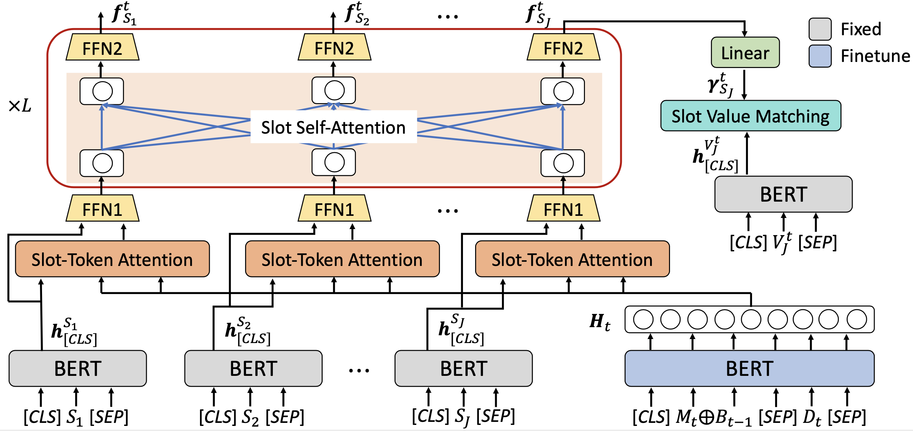

# DST-STAR

This is the Pytorch implementation of our work: **Slot Self-Attentive Dialogue State Tracking. Fanghua Ye, Jarana Manotumruksa, Qiang Zhang, Shenghui Li, Emine Yilmaz. WWW 2021.** [[paper](https://arxiv.org/abs/2101.09374)]

## Abstract
An indispensable component in task-oriented dialogue systems is the dialogue state tracker, which keeps track of users' intentions in the course of conversation. The typical approach towards this goal is to fill in multiple pre-defined slots that are essential to complete the task. Although various dialogue state tracking methods have been proposed in recent years, most of them predict the value of each slot separately and fail to consider the correlations among slots. In this paper, we propose a slot self-attention mechanism that can learn the slot correlations automatically. Specifically, a slot-token attention is first utilized to obtain slot-specific features from the dialogue context. Then a stacked slot self-attention is applied on these features to learn the correlations among slots. We conduct comprehensive experiments on two multi-domain task-oriented dialogue datasets, including MultiWOZ 2.0 and MultiWOZ 2.1. The experimental results demonstrate that our approach achieves state-of-the-art performance on both datasets, verifying the necessity and effectiveness of taking slot correlations into consideration.

## Model 

<p align="center">
  
</p>

<p align="center">The model architecture of STAR</p>

## Requirements

+ Pytorch >= 1.6.0
+ Transformers >= 3.1.0 


## Usage
### Data Preprocessing

```console
❱❱❱ python3 create_data.py
❱❱❱ python3 preprocess_data.py
❱❱❱ python3 convert_by_turn.py
```

### Training

```console
❱❱❱ python3 train_STAR.py
```

### Evaluation

```console
❱❱❱ python3 evaluation.py
```

If you don't want to re-train the model from scratch, you can download the saved model_dict from [here](https://drive.google.com/file/d/1Bz86HK4ebLqWlg4bd6voGv5TlT0x2qT6/view?usp=sharing). 

## Citation

```bibtex
@inproceedings{ye2021star,
  title={Slot Self-Attentive Dialogue State Tracking},
  author={Ye Fanghua, Manotumruksa Jarana, Zhang Qiang, Li Shenghui, Yilmaz Emine},
  booktitle={The Web Conference (WWW)},
  year={2021}
  }
```

## Contact

If there are any questions, feel free to contact me at smartyfh@outlook.com.
